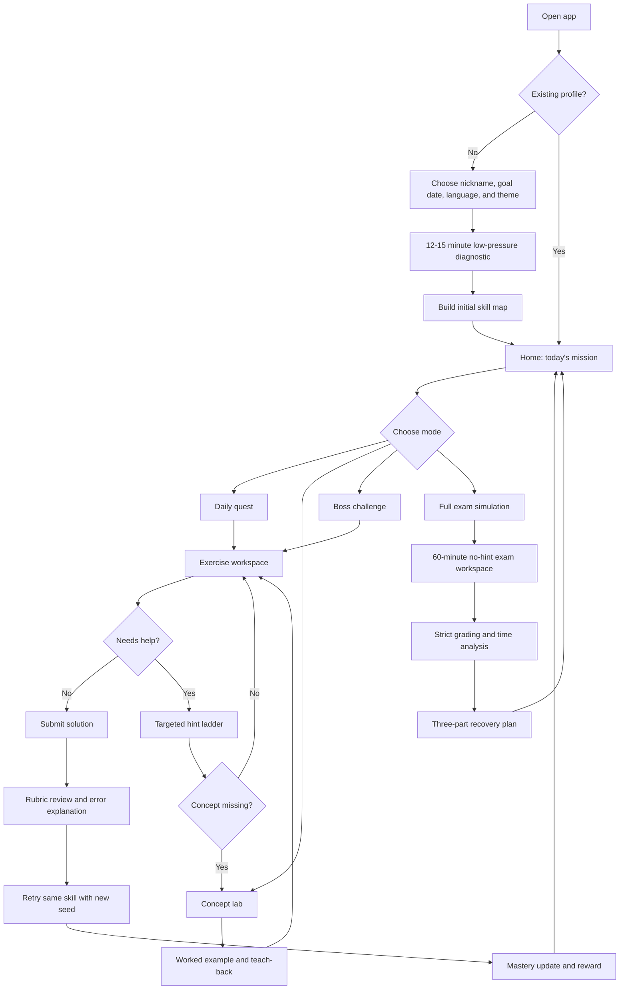
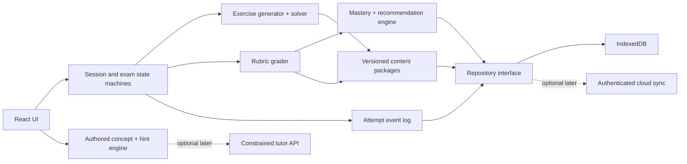

# GymiQuest: Product and Technical Plan

Status: Active technical preview; adaptive training, generated mocks, the verified private 2015–2025 source archive, and strict 2015/2023–2025 replays are working
Scope: Zurich ZAP1 mathematics preparation for one learner first  
Working title: **GymiQuest** (rename after the learner chooses a theme)  
Primary platform: Installable, offline-first web app (PWA) for iPad, laptop, and desktop

## 1. Recommendation in one page

Build a local-first Progressive Web App with two clearly separated modes:

1. **Adventure mode** teaches, adapts, explains, and makes regular practice feel like a game.
2. **Exam mode** reproduces the strict ZAP1 conditions: 60 minutes, free task order, no hints, visible working, partial-credit grading, and a final score based on a versioned official scale.

The app should not behave like a multiple-choice quiz. Its core domain model must understand:

- intermediate calculations;
- alternative valid solution paths;
- units and exact fractions;
- calculation errors versus reasoning errors;
- follow-through credit after an earlier error;
- exhaustive answer sets with penalties for false entries;
- geometry constructions and tolerance;
- diagrams and spatial transformations;
- time spent per task and per attempt.

Use deterministic generators and graders for mathematical truth. Explanations should begin with authored, curriculum-aligned concept material and targeted hint ladders. A conversational AI tutor can be added later, but it must never be the source of truth for answers or official-style points.

The first usable vertical slice should contain:

- one fully dynamic multi-step word problem based on the 2025 Task 5 family;
- exact 0-4 point rubric grading;
- a timer, scratchpad, structured working lines, and a five-level hint ladder;
- concept remediation and a retry with new values;
- local progress storage;
- a short game reward sequence;
- an early geometry-canvas spike based on Task 7, because that is the largest UI risk.

## 2. What the 2025 paper requires from the product

The supplied 2025 ZAP1 mathematics paper and correction scheme establish the following baseline:

- 60 minutes;
- 9 tasks worth 4 points each, for 36 total points;
- no calculator or other electronic aids in the real exam;
- tasks may be solved in any order;
- calculations and intermediate results must make the reasoning understandable;
- a correct final result without understandable working normally earns 0 points;
- exact rubric rules include partial credit, calculation-error handling, alternative paths, units, and task-specific exceptions.

This makes the **solution path** a first-class object. A final-answer-only data model would be a dead end.

### 2.1 Exercise families visible in the 2025 exam

| Task | Exercise family | Required app interaction | Grading implication |
|---|---|---|---|
| 1 | Missing values, fractions of time, unit conversion | Structured calculation lines plus final box | Recognize alternative calculation orders and exact intermediate milestones |
| 2 | Table-based money word problem and ratios | Editable table, calculation lines, unit-aware result | Different subparts have different working requirements and point values |
| 3 | Exhaustive integer combinations | Add/remove table rows | Grade correct and false entries using a task-specific matrix |
| 4 | Area fractions, tile cost, discrete optimization | Interactive grid/diagram plus calculations | Exact reduced fraction, counts, and optimization milestone |
| 5 | Reverse multi-step fractions, mass, and loss | Ordered solution steps with units | Natural 1/2/3/4 point milestones at successive reverse steps |
| 6 | Inverse proportionality and changing population | Calculation lines and optional person-day model | Accept equivalent models and carry forward a prior subpart value where allowed |
| 7 | Geometric locus construction | Compass, parallel-line, perpendicular-bisector, and shading tools | Grade construction method, correct region, and geometric tolerance |
| 8 | Tetrahedron rolling and spatial orientation | Tap/drag labels on faces and fields | Simulate exact orientation transitions and grade partially correct labels |
| 9 | Cuboid composition, volume, and surface area | Diagram annotations and calculations | Recognize dimensions and component areas as partial-credit milestones |

### 2.2 Representative rubric behavior to preserve

- **Task 5:** the official path gives increasing credit for reaching 54 kg, then 72 kg, then 84 kg, then the final 86.5 kg. This is an ideal first implementation of milestone grading.
- **Task 3:** the score depends on both the number of correct combinations and the number of false combinations. It needs a rubric table, not independent answer checkboxes.
- **Task 7:** the construction is evaluated by distinct geometric steps and an accuracy tolerance. The canvas must retain construction provenance, not only the final pixels.
- **Task 9:** identifying dimensions, height, or individual face areas can earn partial credit even if the final surface area is wrong.

## 3. Product principles

1. **Exam-faithful, emotionally safer.** Practice may be playful and supportive; exam mode must be honest and strict.
2. **Reward method, not guessing.** Points, feedback, and XP should value comprehensible reasoning.
3. **Explain the next missing idea.** Do not dump a full solution when one conceptual nudge is enough.
4. **Generate with mathematics, not prose prediction.** Every generated instance must be provably valid and replayable from a seed.
5. **Keep official and generated content distinct.** Archive papers are static “official replay” content; variants are clearly labeled “practice variation.”
6. **Make uncertainty visible.** If an answer cannot be graded confidently, mark it for learner/parent review instead of pretending.
7. **Protect the child’s data.** Use a nickname, local storage first, no advertising, and no third-party behavioral analytics by default.
8. **Design with the learner.** Theme, reward style, session length, and visual density should be tested with the daughter, not assumed by adults.

## 4. Initial scope and explicit non-goals

### Version 1 includes

- mathematics only;
- German learner UI, with an optional English parent/teacher coaching guide;
- the 2015-2025 archive as the source corpus;
- dynamic variants for the recurring exercise families;
- strict 60-minute full mocks;
- deterministic partial-credit grading;
- a concept library and targeted hints;
- learner progress, timing, mastery, and error-type tracking;
- a parent/coach dashboard;
- installable and usable offline after initial setup;
- export/import of all learner data.

### Version 1 does not include

- automatic recognition of arbitrary handwriting;
- AI-generated answer keys or AI-controlled scoring;
- live multiplayer, public leaderboards, chat, or social profiles;
- the German-language ZAP papers;
- a public marketplace of exam content;
- a native iOS app unless PWA limitations become a demonstrated problem;
- a complex backend before cross-device sync is actually needed.

## 5. Users and roles

### Learner

Needs a clear next action, short sessions, explanations without shame, visible improvement, and realistic exam rehearsal.

### Parent/coach

Needs to see patterns rather than surveillance: weak skills, avoidable error types, time allocation, mock trajectory, and what to practice next.

### Content author

Initially the parent/developer. Needs a private authoring and validation surface for importing exam tasks, defining generators, encoding rubrics, and testing examples.

## 6. Information architecture

### Learner routes

| Route | Screen |
|---|---|
| `/` | Profile entry / resume |
| `/onboarding` | Goal, device, theme, and diagnostic setup |
| `/home` | Today’s quest, readiness, countdown, and recent win |
| `/map` | Skill worlds and unlocked missions |
| `/practice/:sessionId` | Guided practice session |
| `/review/:attemptId` | Rubric, corrections, explanations, and retry |
| `/concept/:skillId` | Concept lab |
| `/exam/setup` | Mock configuration and rules |
| `/exam/:sessionId` | Strict exam workspace |
| `/exam/:sessionId/results` | Points, grade, timing, and recovery plan |
| `/progress` | Mastery map, history, achievements, and goals |
| `/collection` | Earned cosmetic items and story progress |

### Parent and author routes

| Route | Screen |
|---|---|
| `/parent` | Weekly overview and recommended actions |
| `/parent/skills` | Skill mastery and misconception detail |
| `/parent/timing` | Time allocation and task-return behavior |
| `/parent/mocks` | Mock trend and rubric breakdown |
| `/parent/settings` | Goal date, session plan, export/delete, optional sync |
| `/author/content` | Official items and dynamic templates |
| `/author/rubrics` | Rubric decision trees and test cases |
| `/author/validation` | Seed checks, golden cases, and coverage |

## 7. Complete learner UI flow



### 7.1 Onboarding

Keep onboarding to four short screens:

1. **Who is playing?** Nickname only; avatar and visual theme.
2. **What is the goal?** ZAP1, expected exam date, preferred practice days, and session length.
3. **How should help feel?** Choose concise, visual, story-based, or step-by-step explanations. This can change later.
4. **Quick diagnostic.** Nine short representative prompts, mostly untimed. Measure skill evidence and interaction comfort, not a public “grade.”

Output: an initial mastery map and the first seven-day plan.

**Current web profile slice:** the first three preference screens are consolidated into two calm setup steps, followed by the separate diagnostic choice. The app stores only a nickname, exam date, chosen practice days, 10/15/20-minute session length, preferred help entry, calm/focus/high-contrast visual mode, reading comfort, and geometry-tool side. New Zürich 2027 onboarding preselects 8 March 2027 as an editable convenience; it never replaces a saved date and stops appearing after that cohort date. These preferences are editable from Progress, versioned with the learner state, included in encrypted backup, and migrated onto older profiles without touching XP, mastery, review dates, or learning history. Session length caps the daily quest, practice days set the parent weekly target, and explanation style reorders—but never removes—the five help paths. Visual mode changes presentation rather than grading: Focus hides the daily quest, badges, collection, reward callouts, and expedition wording, but keeps assignments, concept help, XP and assessment cadence, reviews, teacher-paused topics, and the post-assessment recovery plan. Returning to Calm reveals the same derived rewards without rebuilding or deleting evidence. The spacious reading option applies a clearer system typeface with more line spacing and a bounded measure to explanation surfaces, and the chosen drawing hand places the geometry tool rail on that side when the viewport is wide enough. The diagnostic now uses nine Standard-band signals spanning reverse arithmetic, efficient arithmetic, units, fractions, time, money, area, proportion, and geometry. It remains silent, ungraded, and XP-free; independently secure answers create only provisional mastery with a next-day review, while a paused eight-question v1 session remains exactly resumable from its persisted task. Its completion handoff makes the first seven days concrete without pretending to predict future performance: it names the next currently assigned lesson, tomorrow's provisional reviews, and the learner's chosen weekly rhythm, then explains that the exact queue adapts after every round.

### 7.2 Home

The home screen should answer three questions immediately:

- What should I do now?
- How long will it take?
- What progress did I make recently?

Core components:

- one large **Start today’s 15-minute quest** card;
- exam countdown without alarmist wording;
- a readiness band such as “Building,” “Nearly ready,” or “Exam ready,” with a numeric detail available but not dominant;
- three compact skill indicators: strongest, current focus, and due for review;
- last win, such as “You now catch unit mistakes before submitting”;
- shortcuts to Concept Lab and Exam Mode.

### 7.3 Adventure map

Use a map as navigation, not as a second game to manage. Suggested worlds:

1. Number Workshop
2. Fraction Foundry
3. Unit Station
4. Ratio Camp
5. Pattern Vault
6. Geometry Survey
7. Spatial Lab
8. Word-Problem Expedition
9. Exam Summit

Each node shows mastery level, recent accuracy, and whether a review is due. The learner can replay mastered nodes.

### 7.4 Practice exercise workspace

Tablet landscape should be the reference layout:

- **Top bar:** mission name, progress (for example 2/6), optional elapsed time, pause/exit.
- **Left/main pane:** problem text, table, SVG diagram, or manipulable construction.
- **Right pane:** structured working lines, answer controls, and unit picker.
- **Bottom actions:** “I need a hint,” “Check this step,” and “Submit.”
- **Scratchpad:** freehand drawing or typing, explicitly labeled as ungraded unless its objects are structured construction tools.

For narrow screens, stack problem above working. Keep the final answer visible without hiding the working.

Structured calculation line types:

- expression/equation;
- short reasoning statement;
- value with unit;
- fraction;
- table row;
- diagram label;
- construction action.

The learner can add, reorder, and delete lines. The system stores the full change history for feedback but grades the submitted state.

### 7.5 Hint and explanation flow

Hints are a ladder, not a binary reveal:

1. **Read it differently:** restate the question and highlight givens.
2. **Name the idea:** identify the relevant concept without choosing the operation.
3. **Choose the next step:** offer two or three meaningful approaches.
4. **Show one step:** demonstrate only the next transformation.
5. **Full worked solution:** available after a genuine attempt or explicit opt-in.

Each hint records assistance level. It reduces a “solo mastery” signal, not the official-style points shown for the submitted mathematical work. Asking for help should never remove earned game progress.

If the learner selects “I still don’t understand,” open a side sheet with:

- a one-sentence concept;
- a manipulable visual;
- a small worked example with different numbers;
- the common trap relevant to her current error;
- one teach-back question;
- “Return to my problem.”

### 7.6 Review screen

The review screen should lead with evidence:

- points earned out of 4;
- each rubric milestone: earned, missed, or not assessable;
- the learner’s submitted steps beside a canonical or alternative valid path;
- exact error labels in child-friendly language;
- time spent and whether time was unusually high or low for this learner;
- one recommended next action.

Actions:

- Fix only the first incorrect step.
- Try a new variant.
- Open the concept lab.
- Save for later review.
- Ask parent to inspect an uncertain/manual item.

**Current web error-compass slice:** practice, review, repair, and assessment results now persist the first meaningful mathematical hurdle for each affected question as a bounded category, child-friendly title, topic, and `resolved` flag. Placement evidence is deliberately excluded from the learner-facing compass. Progress groups the last 45 days without keeping the completed wrong-answer text, explains a concrete next move, and can open a two-question refresh with a new deterministic seed. The same aggregate patterns inform parent priorities and the corrected-question count. This evidence never changes grading or XP: scheduled reviews and targeted refreshes still award their full smaller fixed value on completion, while mistakes and help affect retention and the next due date. The version-8 learner schema, encrypted backup validator, and legacy migration preserve the evidence safely.

**Current learner-voice slice:** after a completed lesson, scheduled review, securing round, targeted refresh, or periodic assessment, the learner may submit exactly one bounded signal: the idea is clear, more practice is needed, the explanation was unclear, the question was unclear, or the round was too much at once. No free text or completed wrong answer is stored. A relevant signal can open a fresh generated variant or the concept lab immediately; the protected parent view sees only recent aggregate patterns and a concrete calm next action. The signal is a separate append-only record in encrypted backup and is explicitly excluded from XP, mastery, retention, due dates, assessment thresholds, and exam grading.

**Current web round-debrief slice:** each completed lesson, review, securing round, refresh, and periodic assessment now rebuilds its versioned deterministic questions and joins them to bounded result evidence. Per question it shows independent/corrected/assisted/open status, structured milestone evidence, the child-friendly diagnostic, active time, a personal faster/typical/slower signal only after at least three prior topic samples, and an expandable canonical path. The app does not retain or replay the completed wrong-answer value; older ambiguous records are labelled not assessable instead of guessed. One recommended action routes to a separate fresh generated variant or the concept lab, while the scheduled due date acts as save-for-later. Starting either route never changes the XP already awarded. Manual official-exam items continue to use their separate rubric correction surface.

### 7.7 Concept lab

A concept lab should take 5-8 minutes:

1. concrete story or visual;
2. mathematical representation;
3. one guided example;
4. one fading-support example;
5. one independent check;
6. one sentence of learner teach-back.

Each concept has prerequisite links. For example, inverse proportionality can route back to unit rate or person-days rather than repeating the same explanation more loudly.

**Current web slice:** the in-session “idea from the ground up” path now preserves the learner's original answer and active timer, then moves through the authored concept/visual, a generated worked example with different values, and a fresh teach-back check. The learner writes the intended first step in one sentence and must solve the check before returning. The deterministic seed, stage, sentence, answer, attempts, and feedback persist across reload and encrypted backup. Using the path records assisted learning evidence; it never reduces the fixed XP for completing a scheduled review.

**Current standalone concept-library slice:** Home and every topic card now open a calm library containing all 23 concepts. A learner may inspect a locked topic without falsely unlocking it, then visit each prerequisite directly. Inside a topic, a range control and accessible previous/next buttons move through the authored reasoning trace; a deterministic Aufbau example hides its worked path until the learner reveals one step at a time; and a fresh Standard question requires both a one-sentence plan and the mathematical answer. Wrong answers use the existing topic diagnosis, while a correct check offers another fresh round or the real lesson, securing round, or fixed-XP refresh. All 23 topics now have exact, topic-specific playgrounds: reverse arithmetic chains, efficient factor-pair arithmetic, mass conversions, forward and reverse fraction quantities, time fractions, weighted-average and catch-up motion, table complements/averages/differences, reversible price-count-revenue relationships, proportional revenue bundles, complete positive coin combinations, staged number-constraint filtering, unit-area fractions, all three composite cutout/perimeter forms, cost-optimized tiling, generated multi-stage reverse processes, inverse proportion, changing consumption, coordinate transformations, geometric loci, cube-net folding, full tetrahedron orientations with editable multi-roll paths, and recovered cuboid surfaces. These surfaces consume the same structured values and shared algorithms as the generated exercises: factoring preserves the generated round sum or difference; the three table variants preserve totals; the money models remain reversible; enumeration lists every valid positive integer combination or filtered number; 2×2 tiling uses the same placement/optimization model; and area, pyramid, and cuboid generators call the same pure geometry functions as their playgrounds. The tetrahedron transition is calibrated against published Task 8a, is reversible across every edge, and powers ordered three/four-roll response grading; generation v4 pins the new template while v1/v2/v3 paused tasks retain their original question. The motion surface follows the generated average/catch-up variant; the reverse process uses the generated structured milestones; and both supply surfaces preserve person-days mathematically. Playground state is local to the concept lab, feedback is derived from the mathematical model, and manipulating it deliberately changes neither XP nor mastery. Selecting a topic or prerequisite resets the page to the start on narrow screens.

**Current web engagement slice:** Home now derives one finite daily quest from the learner's actual lesson and scheduled-review queue. The quest adapts to the number of available questions, treats an empty queue as a legitimate rest day, and pauses during a strict mock rather than competing for attention. Eight local achievements surface durable evidence already recorded by the engine: starting, independent solving, self-correction, returning for reviews, completing an assessment or mock, and mastering part or all of the topic path. Home and Progress also open the Mathe-Expedition collection: eight equipment milestones use the existing total-XP ledger, while eight story chapters use those achievement signals. Regular lesson, refresh, and full fixed review XP all count; there is no second currency, speed bonus, or lost-streak penalty. Quests, achievements, equipment, and chapters never award XP, change mastery, alter review intervals, affect assessment cadence, or change exam points. The learner-controlled Focus presentation suppresses those optional game surfaces and their expedition language without hiding XP truth, assignments, explanations, periodic checks, or targeted recovery; Calm restores them from the same ledger. Leagues, public comparison, equipped-item selection, and social features remain deliberately deferred.

**Current checkpoint-and-recovery slice:** the 10–15 minute no-hint periodic assessment is presented as an Expeditions-Check before the attempt, while the active question surface remains a quiet game-free check. Its topic report now hands off to a derived Home return trail: each missed topic stays linked to the exact fresh scheduled review already produced by the learning engine, the matching review card is labelled, and the next return can be started or resumed directly. A completed difficult review closes that checkpoint step because the legitimate work counted, while its evidence may still schedule the topic again later. A learner-marked topic switches to a paused shared-explanation step and remains excluded from tasks until the protected adult guide reopens it. The trail stores nothing, awards nothing, and never edits mastery, due dates, assessment cadence, XP, or exam points.

**Current web planning slice:** Home now shows the learner's selected normal session length, a civil-date exam countdown, and an evidence-based readiness band (`Im Aufbau`, `Am Festigen`, or `Prüfungsnah`). The band summarizes learned topics, retention, independent confirmation, and any strict-mock evidence; it is explicitly not a grade prediction. Progress shows every saved preference and provides the edit entry point.

### 7.8 Exam setup

Offer:

- **Official replay:** an archived paper with its original task order and scoring.
- **Generated mock:** a new blueprint matched by skill, point weight, and estimated difficulty.
- **Mini mock:** 15, 30, or 45 minutes for training.

Before a full mock, show a short rules card:

- 60 minutes;
- 9 tasks, 36 points;
- no hints or step checking;
- tasks may be solved in any order;
- visible calculations are required;
- exam timer continues if the app is backgrounded.

Require one deliberate “Start exam” action. Offer a distraction-free theme and optional full-screen mode.

**Current private-archive slice:** the exam setup contains an 11-year shelf for the exact 2015–2025 task and solution PDFs already held by the family. All 22 identities are registered with page count and SHA-256. A multi-file picker hashes each selected PDF, accepts renamed copies only when their content is registered, persists the result in a separate IndexedDB store, and opens tasks or solutions in a responsive local page reader. These sources never enter the public app bundle or learner backup and are removed by the test-profile reset. The capability boundary is explicit: 2015, 2023, 2024, and 2025 each have independently encoded strict replays and original-page correction. The 2016–2022 pairs now provide honest source training instead of passive lookup only: a persisted absolute 60-minute timer, independent task/PDF navigation, flags, active time, paper-attempt marks, solution lockout until submission/timeout, and a resumable per-task self-review. That review records only end result matches, differs/unclear, or not attempted; its result type contains no points, grade, XP, topic mapping, mastery mutation, or adaptive scheduling signal because the one-page answer sheets do not prove method or partial credit. The source-training history and active state use learner schema 11, a separate IndexedDB active-state store, and encrypted-backup payload v3; the PDFs remain excluded and must be reimported on another device. The strict 2025 addendum supports conservative automatic point floors, including its fraction-valued Task 1b route, both explicit Task 6b follow-through levels, and all named Task 9 face values. A strict multiline numeric-equation grammar now recognizes the correction scheme's published calculation routes for Tasks 1a, 1b, 2b, 2c, 4b, 4c, 5, 6, and 9, validates chained operands against the learner's own stated results, and awards only the documented exact or one-calculation-error floor. Task 4b deliberately accepts no one-error credit, while Task 4c preserves both its one-error calculation floor and its independent 15-large-tile floor. The grammar rejects prose, wrong operations, broken chains, and extra or missing equations, leaving every unsupported method for original-page correction. Task 9 requires all three face families or the complete verified equation path before its full four-point floor is fixed. The 2024 scheme keeps all points manual; the 2023 scheme fixes only its truth-table rule and explicitly method-free `156`; and the 2015 scheme fixes only its method-free cube/net pairing score. Only 2024 and 2025 currently have independently verified year-specific mathematics scales, so 2015 and 2023 store corrected points without displaying a grade. The encrypted-backup validator resolves every strict replay and source-only practice through the same edition registry and rejects relabelled state.

### 7.9 Exam workspace

Core behavior:

- fixed deadline persisted at start; do not count down by decrementing a JavaScript variable;
- task grid 1-9 with states: unseen, started, answered, flagged;
- free navigation and “mark for review”;
- auto-save after every meaningful edit;
- unobtrusive warnings at 30, 10, 5, and 1 minute;
- no correctness indicators, hints, animations, XP, or celebratory sounds;
- on timeout, freeze the submission but preserve all work;
- recover correctly after reload or device sleep.

The timer should use an absolute deadline plus monotonic active-time measurements. Practice mode may pause when hidden; exam mode must not.

### 7.10 Exam results

Show results in this order:

1. raw points out of 36;
2. year-specific mathematics grade from a versioned lookup table;
3. task-by-task rubric breakdown;
4. time per task and returns/flags;
5. errors grouped by concept, reasoning, calculation, units, and time management;
6. three recovery missions for the next week.

Do not convert points with one universal formula. Official noten scales are published as tables and should be stored by exam year and track.

### 7.11 Parent dashboard

The default parent view is weekly and calm:

- sessions completed versus planned;
- active practice minutes, excluding idle/background time;
- mastery changes by skill;
- mock scores and year-specific grades;
- most common error types;
- tasks where time is lost;
- hint dependence versus independent success;
- recommended three-session plan.

Avoid exposing a replay of every hesitation. The dashboard exists to support coaching, not pressure.

**Current web parent slice:** learner Progress now links to a separate Begleitansicht protected by a 4-8 digit device-local PIN. Only a salted PBKDF2 verifier is persisted; the PIN itself is never stored and is deliberately excluded from learner backups. The dashboard derives a calm seven-day summary, fällige Reviews, independent-versus-assisted evidence, aggregate active time, durable mathematical error patterns, three topic priorities, recent mock results, and a concrete three-session plan from the existing append-only learning history. The plan now uses the learner's selected weekly days and preferred session length. A learner-paused topic enters a separate dated coaching queue and disappears from adaptive practice. Opening that request gives the adult a four-part conversation guide—goal, plain-language idea, authored worked steps, and teach-back—plus the likely hurdle and prerequisite chain. All 23 guides now have authored English equivalents, including prerequisite names and topic-specific worked paths. The adult can switch only this shared guide between German and English; that preference is stored beside the local PIN verifier, outside learner history and backups. Learner questions remain German so both participants refer to the same Zürich curriculum material, and the UI states that this is not full learner-language or curriculum localization. The German guide remains derived from the same versioned lesson and diagnosis content as learner support, and the adult deliberately reopens the topic from inside it after the explanation. Generated mock development is now shown only inside the latest comparable blueprint version: each run remains a lower-to-upper point range until written-method points are reviewed, and a direction is named only when the newest and earliest ranges do not overlap. No generated range is converted to a school grade or mixed with an official year scale. None of these actions changes XP, mastery evidence, review scheduling, assessment cadence, or exam points, and the dashboard does not replay individual clicks. Verified year-specific grade trends remain follow-up work until additional archive years and their own scales are independently validated.

**Current content-author validation slice:** the protected companion area can open a read-only Prüflabor backed by the production `generateQuestionsForTask` path. It spans the complete 23-topic by three-band matrix, creates a fresh deterministic version-4 task on demand, displays the prompt and production visual together with the canonical answer, hint, easier explanation, full worked route, structured milestones, candidate count, structure score, and exact reproduction seed, and opens the existing privacy-bounded report in a separate tab. Each sample can switch into the actual `TaskPlayer` and `QuestionStage`, so manual and automated validation exercise the same response widgets, construction workbench, diagrams, help ladder, focus behavior, and defect link as normal training rather than a parallel preview implementation. A session-local 69-field checklist and “next open field” action support systematic sampling without creating durable learner or author data. Every sample is a one-question, zero-XP task whose session changes are deliberately not persisted, so visiting, answering, checking, reporting, or leaving the lab cannot change mastery, retention, reviews, assessment cadence, XP, or exam points. The three-engine release gate opens all 23 topic families through that learner surface, rotates the three bands, requires a visible focusable response control, checks horizontal reflow, and runs WCAG A/AA automation; deterministic domain tests cover every one of the 69 topic-band cells. This tool supports—and explicitly does not replace—the independent teacher/corrector release gate.

## 8. Game design

### 8.1 Core loop

```text
Choose mission -> solve -> inspect rubric -> repair error -> retry -> earn mastery + cosmetic reward -> unlock next mission
```

### 8.2 Progression

Use two separate progress systems:

- **Mastery:** evidence-based and never spendable.
- **XP/collectibles:** motivational and cosmetic.

Suggested mastery states:

- Discovering
- Practising
- Reliable
- Exam ready
- Review due

Suggested rewards:

- map locations;
- avatar equipment;
- room/base decorations;
- short story chapters;
- badges for behaviors such as checking units, finding a second method, or correcting an error.

### 8.3 Reward rules

The learning engine keeps assignment, XP, and exam score as separate systems:

- **Mastery and retention decide what is assigned.** A review appears because it is due or because an assessment exposed a gap.
- **XP measures legitimate completed learning work.** It does not decide mastery and cannot replace an assessment result.
- **ZAP points and grades remain separate.** They are calculated only from the exam rubric.

Reviews are difficult maintenance work, not easy tasks or an XP-farming loophole. They use fresh generated questions, award a smaller fixed amount of XP than lessons, and always award that amount when the scheduled review is completed—even if the review reveals mistakes or the learner asks for help. There is no anti-farming cap and no mistake/help deduction. Those signals change retention and the next review date, not whether the work counted. Once all lesson topics are mastered, the engine stops assigning new lessons and the intended long-term loop is scheduled reviews plus periodic assessments.

**Current adaptive-difficulty slice:** every newly assigned task persists a version-4 generation profile. Lessons deliberately ramp through `Aufbau -> Standard -> Prüfungsnah`; prerequisite refreshes use Aufbau then Standard; error refreshes use Standard then Prüfungsnah; placement uses Standard; periodic assessments and generated mock parts use Prüfungsnah. Scheduled reviews never use Aufbau. A fragile memory receives Standard retrieval, while stable later reviews become increasingly Prüfungsnah. XP is not an input. For each question, the engine builds a deterministic pool of valid instances from the existing verified generator, removes duplicate prompts, scores topic-specific mathematical structure, and selects a seed-varied candidate inside the appropriate band. Within-round duplicate prevention then retries another deterministic band candidate, so two Standard review questions do not collapse into the same prompt. Structural signals dominate number size: examples include average-speed versus catch-up models, table differences versus complements, reflections versus rotations, corner cut-outs versus perimeter notches, parallel/circle/bisector constructions, and missing-face versus full multi-roll spatial paths. The selected band and algorithm version live in the paused task or mock blueprint: fixed-band version-2, variable-band version-3, and legacy unprofiled/version-1 work still replay exactly, while new version-4 tasks and mocks use the full current template set. Property tests cover all 23 topics for deterministic replay, distinct bands, exact grading, strictly greater exam-band difficulty evidence than the Aufbau band, and duplicate-free same-band review rounds.

**Current adaptive lesson-pacing slice:** a newly assigned lesson uses the most recent completed round involving its topic or an immediate prerequisite to choose a bounded two-, three-, or four-question round. Repeated independent work starts at Standard and removes one introductory repetition; a learner without relevant evidence keeps the full Aufbau-to-Prüfungsnah ramp; low recent independence adds one Aufbau scaffold rather than changing points or hiding the existing securing round. A selected 10-minute session caps that supported path at three questions. Inside the lesson, each completed question changes only the next unshown difficulty: independent work steps up, a corrected or assisted solution repeats the level, and an unresolved item steps down. No level is repeated more than twice in one round; after that, the path returns to the nearest current or initially planned level instead of drilling identical prompts. The chosen length, pacing mode, revised band path, seed, and generator version live in the active task snapshot, so reloads, encrypted backups, and exercise reports replay the same questions. Difficulty labels remain internal evidence rather than another child-facing status. Reviews, refreshes, placement, assessments, mocks, XP thresholds, and the configured lesson mistake policy remain unchanged.

Every configured XP threshold unlocks an assessment. XP earned above the threshold is carried into the following cycle instead of being discarded. Assessment XP does not advance its own next threshold.

Award XP for:

- completing a focused session;
- showing a valid method;
- self-correcting after feedback;
- mastering a previously weak skill;
- returning for spaced review;
- completing a reflection;
- improving time while maintaining accuracy.

Do not award large bonuses for raw speed, consecutive days without grace, or perfect first attempts. Do not use loot boxes, paid currencies, public rankings, or loss-aversion notifications.

### 8.4 Challenges

- **Daily quest:** 10-20 minutes, adaptive mix.
- **Side quest:** learner-selected skill.
- **Boss challenge:** a 10-15 minute mixed set with no hints during the attempt.
- **Weekly mock:** initially 30 minutes, later a full 60 minutes.
- **Recovery quest:** automatically generated from a mock’s first three highest-value weaknesses.

Exam mode contains no visible game layer. Rewards are granted only after the full review is complete.

## 9. Content and exercise engine

### 9.1 Separate three kinds of content

1. **Official archive items:** exact, static reproductions for private practice and calibration.
2. **Authored variants:** original questions based on recurring skills and structures.
3. **Generated instances:** deterministic parameterized versions of an authored template.

Do not publish official wording or artwork until reuse rights have been verified. For a public product, prefer original wording and diagrams while linking to the official archive.

### 9.2 Exercise template model

```ts
type ExerciseTemplate = {
  id: string
  version: number
  title: string
  skillIds: string[]
  sourceRefs: SourceReference[]
  responseSchema: ResponseSchema
  difficulty: DifficultyModel
  generate(seed: string, level: number): GeneratedExercise
  solve(instance: GeneratedExercise): SolutionGraph
  rubric: RubricDefinition
  hints: HintGraph
  explanationRefs: string[]
}

type GeneratedExercise = {
  instanceId: string
  templateId: string
  templateVersion: number
  seed: string
  variables: Record<string, unknown>
  prompt: PromptDocument
  expected: SolutionGraph
}
```

The saved seed and template version must recreate the exact prompt, diagram, solution, and rubric indefinitely.

### 9.3 Difficulty controls

Difficulty is multidimensional:

- number size and arithmetic complexity;
- number of dependent steps;
- fraction/decimal form;
- unit conversion burden;
- amount of irrelevant information;
- linguistic complexity;
- representation (table, text, diagram, mixed);
- number of valid approaches;
- construction precision;
- time target;
- amount of scaffold initially visible.

Do not equate “larger numbers” with harder mathematics.

### 9.4 Generator constraints by 2025 family

| Family | Key generation constraints |
|---|---|
| Missing values/time fractions | Exact divisibility, valid time conversion, one intended missing value |
| Ticket table/ratio | Integer visitor counts, internally consistent totals, solvable ratio |
| Coin combinations | Finite nonempty integer solution set; table size may exceed answer count |
| Tiling/optimization | Grid dimensions and tile sizes align; optimum is provably unique or equivalent optima are declared |
| Reverse mass chain | Chosen jar mass/count and fractions produce age-appropriate exact or one-decimal milestones |
| Person-days | Capacity is conserved; staged population changes remain positive and exactly solvable |
| Locus construction | Nonempty visible target region; boundaries and intersections stay inside canvas; tolerance scales correctly |
| Tetrahedron rolling | Orientation state is computed from face permutations; path is valid and unambiguous |
| Cuboid composition | Component dimensions and volume agree; requested surface can be recovered from givens |

### 9.5 Generation validation

Every template must pass:

- at least 1,000 seed-based property tests before release;
- solver agreement with displayed answer;
- uniqueness or declared multiple solutions;
- exact rational arithmetic checks;
- no invalid/negative quantities;
- no clipped or overlapping diagrams at supported viewports;
- difficulty bounds;
- answer and unit formatting tests;
- deterministic replay after serialization.

Never ask a language model to invent numbers and trust the resulting answer key.

## 10. Grading engine

### 10.1 Solution graph

Model a solution as a directed graph of mathematical states and justifications, not a single list. This supports alternative routes.

Example for a reverse mass problem:

```text
108 x 500 g -> 54 kg -> reverse cooking fraction -> 72 kg
-> reverse rejected fraction -> 84 kg -> add transport loss -> 86.5 kg
```

Each node records:

- normalized exact value;
- optional unit and dimension;
- concept/operation;
- dependencies;
- equivalent representations;
- rubric milestone IDs;
- common misconception signatures.

### 10.2 Rubric model

```ts
type RubricDefinition = {
  maxPoints: number
  rules: RubricRule[]
  aggregation: "highest-path" | "sum-capped" | "matrix" | "custom"
  specialCases?: SpecialCaseRule[]
}

type RubricRule = {
  id: string
  points: number
  evidence: EvidencePredicate
  dependsOn?: string[]
  carryForward?: CarryForwardPolicy
  feedbackKey: string
}
```

Support these first-class policies:

- exact milestone credit;
- one calculation-error allowance;
- reasoning error classification;
- copied-value error treated like a calculation error;
- carry-forward from an incorrect prior value;
- correct result with missing/incorrect unit;
- alternative correct path;
- maximum of several eligible scores;
- false-answer penalty matrix;
- geometric object/method/tolerance predicates;
- manual-review fallback.

### 10.3 Response types

- integer, decimal, and exact rational;
- value plus unit;
- expression or equation line;
- ordered or unordered table rows;
- selection/label placement;
- structured geometry construction;
- short reasoning choice/text;
- freehand scratchpad (not automatically graded in v1).

### 10.4 Exact mathematics

- Store rational values as numerator/denominator, never binary floating point.
- Normalize compatible units before comparison.
- Preserve the learner’s displayed form for feedback.
- Distinguish `3`, `3 min`, `3/1`, and an unreduced fraction when the rubric does.
- Use tolerances only where the content definition explicitly permits them.

### 10.5 Geometry grading

Store geometry actions as semantic objects:

- point;
- line/ray/segment;
- parallel or perpendicular constraint;
- circle with center and radius;
- perpendicular bisector created by compass arcs;
- shaded polygon/region;
- label.

Grade object relationships analytically. Do not grade a screenshot. For example:

- distance from constructed parallel to road line;
- circle center and radius;
- perpendicular-bisector relation;
- whether the selected region satisfies all half-plane, circle, and exclusion constraints;
- intersection-point deviation in millimeters after applying the problem scale.

### 10.6 Confidence and review

Each grade result has a confidence:

- **certain:** deterministic structured evidence;
- **probable:** equivalent expression parsing succeeded but wording is ambiguous;
- **manual:** freeform reasoning or unsupported construction.

Only “certain” scores should automatically affect strict mock grades in v1. Other items enter a parent review queue.

### 10.7 Grade scales

Store scales as content:

```ts
type GradeScale = {
  jurisdiction: "ZH"
  track: "ZAP1-LG"
  year: number
  subject: "mathematics"
  maxPoints: number
  bands: Array<{ min: number; max: number; grade: number }>
  sourceUrl: string
}
```

Never infer a scale for a year that has not been imported and verified.

## 11. Explanations and misconception system

### 11.1 Authored concept graph

Each concept record includes:

- concise definition in age-appropriate German;
- prerequisites;
- multiple representations;
- worked examples;
- common mistakes and diagnostic signatures;
- hint ladder fragments;
- teach-back prompts;
- related exercise families.

Initial concepts include:

- order and inverse operations;
- fraction of a quantity;
- reversing a fraction/change;
- time and mass conversion;
- ratio and unit rate;
- direct versus inverse proportionality;
- exhaustive systematic search;
- area fraction and discrete optimization;
- geometric loci and half-planes;
- perpendicular bisectors;
- spatial orientation under rotations;
- volume versus surface area;
- unit discipline and answer checking.

### 11.2 Error-specific explanations

Examples:

- Multiplied by `3/4` when reversing a cooking loss -> show why reversing requires division by `3/4`.
- Used direct rather than inverse proportionality -> switch to a fixed person-days visual.
- Forgot both opposite cuboid faces -> unfold a net and pair faces.
- Listed valid coin combinations but missed cases -> teach a monotonic systematic table.
- Drew the right bisector with the wrong tool -> explain that the real rubric checks construction evidence.
- Correct number, missing unit -> explain when the rubric accepts or penalizes it.

### 11.3 Optional conversational tutor, later

If added, it should receive only:

- the current authored problem;
- canonical solution graph;
- rubric;
- learner’s submitted structured steps;
- concept records explicitly allowed for the response.

It may rephrase, ask a Socratic question, or choose an authored visual. It may not alter the answer key, award points, create an official-grade result, or receive the child’s real name. Parent opt-in and an easy off switch are required.

## 12. Mastery and adaptation

### 12.1 Skill evidence

For every attempt, record separate signals:

- rubric points;
- difficulty;
- highest hint level;
- first-attempt versus corrected success;
- relevant error categories;
- active time;
- recency;
- performance in practice versus no-hint mock mode.

Maintain two mastery values:

- **supported mastery:** can solve with available help;
- **independent mastery:** can solve without help under realistic conditions.

**Current web mastery-evidence slice:** every generated question result stores its difficulty band together with attempts, help use, active time, and independent success. A completed lesson always keeps the XP earned under the published lesson rule, but it unlocks dependent topics only when the lesson has enough supported and independent evidence with at most one performance miss. Otherwise the topic remains `learning` and the engine assigns a two-question `Standard -> Prüfungsnah` securing round with a fresh deterministic seed. Securing rounds award the topic's smaller fixed XP on completion; a difficult round schedules another fresh round without removing any earlier XP. Two independently solved securing questions move the topic to `mastered`, unlock eligible dependants, and schedule the first spaced review. Reviews still never relock mastered prerequisites: their evidence changes supported/independent mastery, retention, difficulty, and due date. Periodic assessments and strict mocks update the same two signals. Learner Progress and the protected parent view show the supported-versus-independent gap and name the securing round explicitly. Schema 7 migrates existing mastered profiles conservatively so previously unlocked paths remain unlocked.

### 12.2 Recommendation priority

A simple transparent heuristic is enough for v1:

```text
priority =
  0.35 * mastery_gap
  + 0.25 * review_overdue
  + 0.20 * exam_frequency_weight
  + 0.10 * recent_error_recurrence
  + 0.10 * time_pressure_gap
```

Apply constraints:

- no more than two hard tasks in a row;
- include one confidence-building task per session;
- do not repeat the same surface story immediately;
- schedule retrieval after 1, 3, 7, 14, and 30 days, adjusted by success;
- cap daily recommendations to the agreed session length.

**Current web consolidation slice:** completing the final prerequisite-ready lesson is
shown as a transition into a continuing consolidation phase, not as an empty or
finished course. Reviews keep their smaller fixed XP and continue to unlock periodic
assessments. Assessment sampling is history-aware: never-assessed mastered topics get
the first coverage pass, then each later check reserves at most three places for the
most fragile topics and fills the remaining places with the least-recently assessed
material. A weak topic can therefore return without permanently crowding broad course
coverage out of the assessment.

### 12.3 Readiness

Readiness should combine:

- independent mastery weighted by ten-year task frequency;
- recent full-mock score distribution;
- time-completion reliability;
- frequency of unit/method omissions;
- performance stability across different generators.

Show uncertainty. “Readiness 72-80%” is more honest than “76%” when the evidence is sparse.

## 13. Time tracking

Record an event timeline rather than only total duration:

- session start/end;
- task opened/left/returned;
- active/hidden state;
- step added/edited/deleted;
- hint opened and time viewed;
- answer submitted;
- flag toggled;
- timeout.

Derived metrics:

- active time per task and point;
- first-pass time versus review time;
- time before first meaningful step;
- time after final edit before submission;
- number of task switches;
- unfinished tasks at timeout;
- accuracy when fast, normal, or slow relative to the learner’s baseline.

Timing rules:

- Practice mode: pause or exclude hidden time and allow a manual pause.
- Boss mode: exclude hidden time but show the interruption.
- Exam mode: absolute deadline continues while hidden or asleep.
- Parent dashboard: show trends, not a judgement for every slow task.

**Current web timing slice:** lessons, reviews, repairs, and the low-pressure placement check now expose an explicit manual pause beside the active-time counter. Pausing persists on the active session, hides the problem so work cannot continue against a stopped clock, preserves the current answer, and survives navigation, reload, IndexedDB storage, and encrypted backup; sessions saved before the field existed remain resumable. Hidden browser time is still excluded. Periodic assessments deliberately expose no pause control and ignore an invalid persisted pause flag, while strict generated and official mocks continue to use their absolute deadline across backgrounding and sleep. Component tests cover stop/resume and the assessment boundary, and browser inspection covers iPad landscape plus a 375-pixel viewport without horizontal overflow.

## 14. Technical architecture

### 14.1 Recommended stack

- **Language/UI:** TypeScript and React.
- **Build:** Vite, because this is a client-heavy application without SEO or server-rendering needs.
- **Install/offline:** Web App Manifest plus service worker and an explicit offline content cache.
- **Persistence v1:** IndexedDB behind a repository interface; downloadable encrypted backup file.
- **Rendering:** semantic HTML for text/tables, SVG for diagrams, pointer-event canvas only where freehand input is necessary.
- **Math:** exact rational/unit domain types and KaTeX-style display rendering.
- **Tests:** unit/property tests plus Playwright on Chromium, Firefox, and WebKit, with iPad-sized viewports.
- **Deployment:** static HTTPS hosting. Add an API/backend only for optional sync or tutoring.

Why PWA first:

- one codebase for iPad, Mac, and desktop;
- installable app-like launch;
- offline practice is achievable with service-worker caching;
- easy iteration without App Store distribution;
- a later native shell remains possible if Apple Pencil or platform integration demands it.

Current implementation evidence:

- the production manifest is explicitly `de-CH`, standalone, root-scoped, and supplies separate 192 px, 512 px, maskable, and 180 px iPad home-screen icons;
- every production build verifies the manifest, raster dimensions, iPad metadata, service-worker registration, and required precache entries;
- Chromium, Firefox, and iPad-sized WebKit now create a learner, persist the profile in IndexedDB, activate the production service worker, shut their own HTTP server down, and must reload the same saved learning plan from the offline app shell;
- the assets-only Cloudflare Pages configuration applies a restrictive content-security policy, immutable caching only to fingerprinted assets, explicit service-worker revalidation, and a build gate that rejects PDFs, learner backups, source maps, oversized files, or an invalid host manifest;
- Chromium, Firefox, and iPad-sized WebKit also load the app through the local Cloudflare Pages runtime and verify that the production security/cache headers do not break the learner shell or service-worker registration;
- a physical iPad Add to Home Screen, standalone launch, and saved-session airplane-mode run remain a release gate because desktop emulation cannot prove Safari installation behavior or device storage durability.

### 14.2 Module boundaries



The generator, solver, grader, and mastery engine should be framework-independent TypeScript packages. This keeps mathematical logic testable and makes a later Swift client possible.

### 14.3 Suggested repository structure

```text
src/
  app/                 routing, providers, startup
  domain/
    exercises/         template contracts and generated instances
    math/              rationals, units, expressions
    grading/           solution graph and rubric policies
    mastery/           skill evidence and recommendations
    timing/            session clocks and event derivation
  content/
    official/          private imported archive metadata/items
    templates/         original dynamic templates
    concepts/          lessons, hints, misconception mappings
    scales/            verified year-specific grade tables
  features/
    onboarding/
    home/
    practice/
    exam/
    review/
    progress/
    parent/
    author/
  infra/
    persistence/
    export/
    service-worker/
    optional-sync/
  ui/                  accessible reusable components
tests/
  golden/
  generators/
  graders/
  e2e/
```

### 14.4 Core records

- `LearnerProfile`
- `Skill`
- `ConceptLesson`
- `ExerciseTemplate`
- `ExerciseInstance`
- `SolutionGraph`
- `RubricDefinition`
- `GradeScale`
- `Attempt`
- `AttemptEvent`
- `GradeResult`
- `MasterySnapshot`
- `Recommendation`
- `RewardLedgerEntry`
- `ExamBlueprint`
- `ContentPackageVersion`

### 14.5 State machines

Define explicit state machines for:

- practice session: `loading -> solving -> reviewing -> repairing -> rewarded -> complete`;
- exam: `setup -> running -> submitted|timedOut -> grading -> review`;
- content import: `draft -> validated -> approved -> published -> retired`.

This prevents timer, reload, and double-submission edge cases from leaking across UI components.

## 15. Privacy, safety, and accessibility

### Privacy defaults

- nickname, not full name;
- no birth date unless truly necessary;
- local-only data in v1;
- parent PIN for dashboard/settings;
- no ads, trackers, public profiles, or social features;
- export and delete controls;
- optional sync is encrypted in transit and designed for minimal data;
- optional tutor requests exclude identity and unrelated history.

If the app becomes a public/cloud product, obtain specific privacy and content-rights advice before launch, especially because the user is a child.

### Accessibility

- keyboard operability for all non-drawing interactions;
- large touch targets;
- screen-reader labels and logical heading order;
- color never carries meaning alone;
- reduced-motion setting;
- high contrast and scalable text;
- optional reading-width and typeface preferences;
- diagrams with textual summaries where possible;
- no reward animation that blocks the next action;
- support left-handed canvas tool placement.

**Current automated accessibility slice:** every release run now applies Axe rules for WCAG 2.0/2.1 A and AA plus WCAG 2.2 AA in Chromium, Firefox, and iPad-sized WebKit. The journeys cover onboarding, the start diagnostic, learning plan, progress, lesson introduction, active practice, concept library, generated-mock setup, and parent PIN entry. Narrow-viewport journeys prove keyboard activation, a visible focus indicator, reduced-motion behavior, persisted high-contrast and minimal-focus modes, and reflow without horizontal overflow at 320 CSS pixels. The minimal-focus journey also proves that core assignments, XP, and reviews survive reload while optional game surfaces stay absent. The audit corrected shared contrast defects in selected onboarding copy, lesson diagrams, difficulty badges, locked curriculum and achievement states—including the narrow course-map label—concept status labels, and unavailable archive controls. This is an automated regression gate, not evidence that every screen-reader announcement, text-zoom state, touch target, drawing interaction, or physical iPad behavior is usable; those remain manual release checks.

**Current learner-controlled accessibility slice:** profile schema 11 persists a standard or spacious reading mode and a right- or left-side geometry tool preference. Spacious mode changes only authored explanation surfaces, using a clearer local typeface, more line spacing, and a bounded reading measure. The geometry workbench places its tool rail beside the plan on the chosen drawing-hand side at wide viewports and above the plan on narrow screens. Both settings survive reload and encrypted backup, migrate safely from schema 10, and are covered across Chromium, Firefox, and iPad-sized WebKit without changing any mathematical evidence or grading.

**Current public-readiness evidence slice:** the PIN-protected companion area now exposes a separate guided protocol for the work that automation cannot honestly complete. Seven sections and 43 concrete checks cover the physical iPad install/offline/force-close, reading/geometry, manual accessibility, and private archive/source-training gates; independent correction of the encoded 2015, 2023, 2024, and 2025 replays; a three-week uncoached learner pilot with panel, two-assessment, and unseen-task evidence; and operator/privacy/content-rights preparation. Each checked attestation stores its local timestamp together with the exact tested source build, while an on-demand runtime snapshot adds standalone mode, service-worker control, reported connectivity, viewport, URL, and user agent. The Markdown hand-off includes those per-check build references plus blank reviewer, deviation, and decision fields. The build is derived from the full Git commit and explicitly marked dirty when local source changes are present, with deployment-environment overrides supported; dirty or unversioned builds are visibly unsuitable as release evidence. It contains no learner name, answers, XP, or history; it lives in a separate IndexedDB store, is excluded from the encrypted learner backup, and is cleared by the complete test-profile reset. Every screen and the export state the epistemic boundary explicitly: a local checkmark records an attestation, not its truth or independence, and cannot change the product from technical preview to public release.

## 16. Eleven-year content ingestion plan

Treat content ingestion as editorial work with automated support, not blind PDF conversion.

### Step 1: Archive inventory

For every year 2015-2025, register:

- task PDF and solution/correction PDF;
- page/task boundaries;
- total time and points;
- official grade scale when available;
- curriculum/format version;
- source URL and local checksum.

### Step 2: Human-verified transcription

For each task:

- transcribe prompt and givens;
- redraw diagrams as original SVG where needed;
- record final answers;
- encode all rubric rules and later corrections/addenda;
- verify against the rendered PDF, not text extraction alone.

### Step 3: Taxonomy

Tag each subtask with:

- concept and prerequisite skills;
- response type;
- number of steps;
- arithmetic complexity;
- diagram type;
- point milestones;
- common error opportunities;
- estimated solve time.

### Step 4: Recurrence matrix

Build a matrix of skills by year. Use it to:

- prioritize template development;
- weight readiness;
- assemble balanced mocks;
- identify format changes;
- avoid overfitting the 2025 paper.

### Step 5: Rubric golden cases

For every official item, create test submissions for:

- full credit;
- every documented partial score;
- one calculation error;
- one reasoning error;
- missing/wrong unit;
- alternative path;
- special addendum cases;
- zero credit.

### Step 6: Dynamic family authoring

Only after several years in a family have been compared, create an original generator and its difficulty controls. Keep official replay and generated practice separate.

## 17. Delivery roadmap

Estimates assume one experienced developer who is newish to the chosen web stack. “Focused week” means close to full-time; part-time evening work will take longer.

### Phase 0 - Content audit and acceptance criteria (3-5 days)

- inventory all eleven years from 2015 through 2025;
- build the initial skill-by-year matrix;
- encode the 2025 task and rubric taxonomy;
- decide learner language, primary device, and visual theme;
- write golden acceptance cases for Tasks 3, 5, 7, and 9.

**Gate:** every documented 2025 score path can be represented by the proposed rubric schema.

### Phase 1 - Risk-first prototypes (1 focused week)

- clickable learner flow from Home to Practice to Review;
- working dynamic Task 5 family with structured steps;
- geometry construction spike for Task 7;
- iPad Safari/WebKit interaction test with touch and Pencil if available;
- short learner usability session.

**Gate:** the learner can solve and understand a variant without developer explanation; the geometry approach is technically viable.

### Phase 2 - Core platform (1-2 focused weeks)

- React/TypeScript/PWA shell;
- profile and local persistence;
- content package/version loader;
- session and exam state machines;
- robust timer and event log;
- exact rational and unit primitives;
- solution graph and initial rubric engine;
- export/import backup.

**Gate:** reload, offline use, and timeout recovery lose no submitted work.

**Current versioned curriculum-package slice:** learner schema 12 persists the exact course ID and package version. The registered `zh-zap1-math@1` manifest owns the 23-topic order, nine-topic diagnostic coverage, periodic-assessment limits, XP policy, Zürich jurisdiction, `de-CH` learner locale, `Europe/Zurich` timing scope, 60-minute/36-point exam contract, and 2015–2025 source-archive range. The learning engine consumes those policies through the learner package rather than parallel literals. Unversioned legacy Zürich profiles migrate to v1; encrypted restore distinguishes an unsupported curriculum from a damaged file and never relabels an unknown package as Zürich. Progress and backup preview show the exact package and state plainly that another country or learner language needs a separately validated package. Only the Zürich package is currently registered; the UI does not offer a fake selector for content that does not exist.

**Current task-to-package contract slice:** every new placement, lesson, scheduled review, securing round, targeted refresh, assessment, and author-lab sample now carries the exact curriculum reference. Legacy tasks without that field replay permanently as `zh-zap1-math@1`, rather than following a future active-package default. Generation, resumability, completion, encrypted restore, and privacy-bounded exercise reports reject unknown or learner-mismatched task packages before they can change evidence or XP; Codex reports name the package alongside the deterministic seed. A reusable runtime audit checks each registered package's identity, scope, topic order, prerequisite closure, authored lessons, German/English adult coaching, placement, XP/assessment/exam policies, and every topic-by-difficulty deterministic generator cell. The PIN-protected Prüflabor shows the fast structural result and exact package identity, while the release suite executes the full generator matrix. This is the content-loader acceptance contract for future packages; it does not claim that a second country or learner language already exists.

### Phase 3 - Arithmetic and word-problem MVP (2-3 focused weeks)

- dynamic families corresponding to Tasks 1-6;
- authored concept labs and hint ladders;
- rubric coverage and property tests;
- daily quest recommendation heuristic;
- review/repair flow;
- initial parent skill and timing views.

**Gate:** 1,000 seeds per template pass; all documented partial-score cases pass golden tests.

### Phase 4 - Geometry and spatial reasoning (2 focused weeks)

- Task 7 construction engine and grading;
- Task 8 tetrahedron orientation engine;
- Task 9 cuboid diagram and surface-area family;
- responsive diagram QA;
- manual-review path for unsupported responses.

**Gate:** construction predicates and tetrahedron orientation are tested independently of the UI.

### Phase 5 - Game and adaptive layer (1 focused week)

- map, mastery states, XP, cosmetics, and achievements;
- spaced review queue;
- supported versus independent mastery;
- boss and recovery quests;
- reduced-motion and “minimal focus” mode.

**Gate:** rewards reinforce the intended behaviors and never obscure points or rubric feedback.

### Phase 6 - Full exam and parent coaching (1 focused week)

- official 2025 replay;
- generated 60-minute blueprint;
- task navigation, flags, timeout, and autosave;
- strict results with verified grade scale;
- mock trends and three-mission recovery plan.

**Gate:** a complete mock can be started offline, survive reload/sleep, time out correctly, and produce a reproducible grade report.

### Phase 7 - Eleven-year coverage and hardening (2-4 focused weeks)

- maintain the verified 11-year private source shelf and encode each remaining year-specific rubric needed for graded replay;
- keep 2016–2022 useful through strict source training and bounded self-review until defensible full rubrics exist;
- expand high-frequency dynamic families;
- cross-browser and accessibility testing;
- content-author validation UI;
- backup/restore drills;
- learner and parent pilot over at least three weeks.

**Gate:** no high-severity generator, grader, timer, or data-loss defect; learner can use the app without developer presence.

**Current hardening status:** the 23-topic by three-band generation matrix, deterministic replay, exact grading, difficulty separation, and duplicate prevention are covered by unit/property tests. Cross-browser accessibility is now a release-blocking automated gate across Chromium, Firefox, and iPad-sized WebKit. Independent content correction, manual assistive-technology/device review, and the real three-week learner pilot remain human gates.

### Expected schedule

- Useful vertical slice: about 2 focused weeks.
- Strong mathematics MVP (Tasks 1-6): about 5-7 focused weeks total.
- Complete v1 with geometry, exam, game, and parent dashboard: about 10-14 focused weeks.
- Part-time solo development: plan approximately 4-6 calendar months.

## 18. Verification strategy

### Domain tests

- exact rational and unit normalization;
- generator invariants and deterministic replay;
- solver correctness;
- each rubric branch and special case;
- follow-through and error-count policies;
- geometric relations/tolerance;
- tetrahedron orientation group transitions;
- grade-scale lookup boundaries;
- mastery update and scheduling.

### Golden tests

The supplied 2025 solutions are the initial oracle. Create fixtures that reproduce:

- every final result;
- all explicit intermediate milestones;
- each 0-4 point rubric path;
- all corrections/addenda in the solution PDF.

### UI and browser tests

- learner can complete each response type using touch, mouse, and keyboard where applicable;
- iPad Safari/WebKit viewport is a release-blocking target;
- Chromium and Firefox desktop coverage;
- screen reload, offline launch, and service-worker update;
- timer during backgrounding and sleep;
- exam autosave and timeout;
- export/import round trip;
- reduced motion, zoomed text, and high contrast.

### Human validation

For every significant milestone:

1. watch the daughter use it without coaching;
2. ask what she expected before explaining;
3. record confusion, not just bugs;
4. change one or two highest-impact points;
5. repeat with a fresh problem.

**Current pilot-support slice:** the post-round learner-voice control records the learner's own bounded confusion signal and turns it into an immediate alternative path plus an aggregate parent action. This makes uncoached pilot observations easier to compare without adding surveillance or free-text child data. It supports the five-step human-validation loop; it does not replace watching the daughter use the product or measuring independent performance on unseen tasks.

**Current protected pilot-evidence slice:** the PIN-protected companion view now groups every completed non-placement round into Europe/Zurich calendar weeks and derives active days, completed rounds, independent-answer rates, bounded learner signals, and first-versus-latest no-hint assessment observations. Placement and future-dated records are excluded; the assessment copy reports the literal percentage-point difference without naming it improvement or causation. The view adds no persisted field and repeatedly names what software cannot know: whether the learner worked without coaching, returned voluntarily, faced a genuinely unseen paper-style problem, or demonstrated stable improvement. Those four judgments still require the human-validation loop and the exported release protocol.

The primary product metric is not session count. It is increasing independent success on unseen, exam-like problems within realistic time.

## 19. Main risks and mitigations

| Risk | Impact | Mitigation |
|---|---|---|
| Freeform reasoning cannot be graded reliably | False confidence or unfair score | Structured calculation lines in v1; explicit manual-review fallback; no handwriting OCR promise |
| Geometry canvas is harder than expected | Delays full coverage | Build Task 7 spike in Phase 1 before broad content work |
| Content authoring dominates development | Few trustworthy exercises | Author tools, reusable rubric policies, recurrence matrix, and family-first prioritization |
| Dynamic generator creates invalid instances | Learner loses trust | Deterministic solvers, constraints, 1,000-seed property tests, and versioning |
| Game competes with learning | Shallow engagement | Reward repair/mastery; remove game UI from exams; offer minimal-focus theme |
| Overfitting to 2025 | Weak preparation | Analyze 2015-2025 before setting mastery weights and mock blueprints |
| Grade scale or rules change | Incorrect readiness | Version scales, curriculum, and rubrics by year; never infer missing official data |
| PWA data is cleared or device is lost | Progress loss | Visible export reminders first; optional sync after core app is stable |
| Child data leaks through analytics/AI | Privacy harm | Local-first, no trackers, minimum-data tutor, parent opt-in, delete/export |
| Official content reuse is not permitted publicly | Launch risk | Private use initially; original variants/diagrams; verify rights before distribution |
| Explanations become verbose or patronizing | Learner disengages | Learner-selected style, progressive hints, short concept labs, real usability tests |

## 20. Product decisions and recommended defaults

These decisions should be confirmed before implementation, but the project can start with the defaults below:

| Decision | Recommended default |
|---|---|
| Primary learner device | iPad landscape, also responsive on laptop/desktop |
| UI language | German |
| Initial audience | One daughter and parent, private use |
| Subject | ZAP1 mathematics only |
| Session length | 15 minutes on weekdays, one longer mock on weekends |
| Account/backend | No account; local profile and export/import |
| Theme | Calm “expedition” theme with a minimal-focus alternative |
| Game emphasis | Process and mastery, never public competition |
| AI tutor | Off for MVP; authored explanations first |
| Handwriting | Ungraded scratchpad; structured working for automatic points |
| First official replay | 2025 paper |
| First dynamic family | 2025 Task 5 style reverse multi-step problem |
| First technical risk spike | 2025 Task 7 geometry construction |

## 21. Definition of v1 success

Version 1 is ready when:

- the learner can install and use it offline on the primary device;
- all nine 2025 task families have an appropriate response interaction;
- official replay can reproduce the 2025 paper’s rubric outcomes;
- at least the recurring high-frequency families generate validated original variants;
- a 60-minute mock survives reload/backgrounding and grades deterministically;
- the learner receives useful help without seeing the full solution too early;
- progress distinguishes supported from independent mastery;
- parent recommendations are understandable and actionable;
- all data can be exported, restored, and deleted;
- the daughter chooses to return to it and shows improved independent performance on unseen paper-style problems.

## 22. Recommended first implementation ticket

**Vertical slice: Reverse-chain mass problem**

Build one end-to-end exercise modeled on the structure, not the wording, of 2025 Task 5:

1. Generator chooses final container count/mass, retained fraction, rejected fraction, and transport loss under exactness constraints.
2. Solver builds the four-node reverse solution graph.
3. UI supports calculation lines and value-plus-unit answers.
4. Grader awards 1-4 points for the validated milestones and handles one calculation error.
5. Hint ladder maps errors to reversing fractions, unit conversion, or operation order.
6. Review lets the learner fix the first wrong step and retry a new seed.
7. Attempt events update supported/independent mastery and time metrics.
8. Completion grants a small process-based reward.
9. The full flow works after a page reload and offline.

This slice proves almost every important boundary - generation, exact math, rubric grading, explanations, timing, persistence, adaptation, and game feedback - without waiting for the geometry tooling.

## 23. Sources used for this plan

### Supplied source material

- `2025_mathematik_aufgaben.pdf`
- `2025_mathematik_loesungen.pdf`

### Official/current references

- [Kanton Zurich: Langgymnasium examination, admission calculation, rules, and archive](https://www.zh.ch/de/bildung/schulen/maturitaetsschule/zentrale-aufnahmepruefung/pruefung-fuer-das-langgymnasium.html)
- [Kanton Zurich: ZAP1 requirements valid from 1 August 2026](https://www.zh.ch/content/dam/zhweb/bilder-dokumente/themen/bildung/schulen/maturitaetsschulen/zap/pr%C3%BCfungsanforderungen-zap/pruefungsanforderungen_lg_2027.pdf)
- [Kanton Zurich: 2025 mathematics correction scheme](https://www.zh.ch/content/dam/zhweb/bilder-dokumente/themen/bildung/schulen/maturitaetsschulen/zap/pr%C3%BCfungsvorbereitung_lg/mathematik/2025_mathematik_loesungen.pdf)
- [Vite official getting-started documentation](https://vite.dev/guide/)
- [web.dev: Progressive Web App fundamentals](https://web.dev/learn/pwa/welcome)
- [Playwright official cross-browser documentation](https://playwright.dev/docs/browsers)
